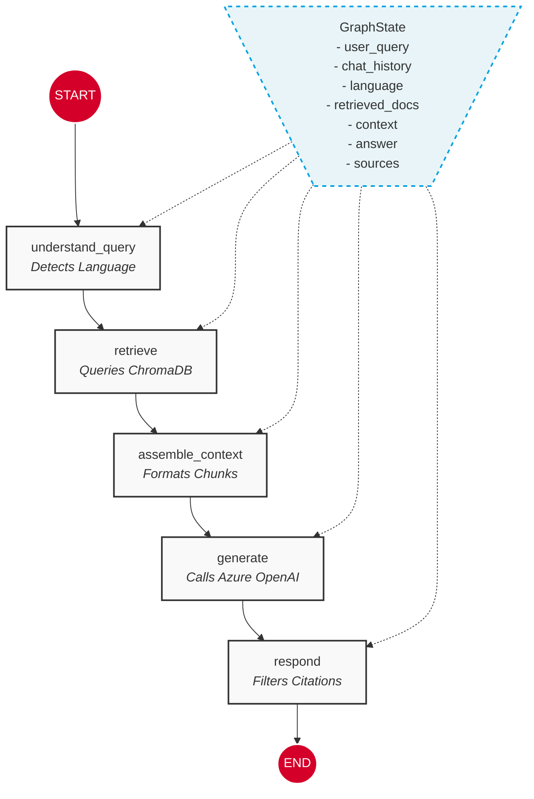

# LangGraph Architecture Visualization

Here is the visual representation of our LangGraph state machine. You can see how the `GraphState` (the shared memory) flows linearly through the 5 nodes we built.

### What happens at each step:
1. **START:** The user submits a question and Streamlit passes the `chat_history`.
2. **understand_query:** Updates the state with `language="en"` or `"ar"`.
3. **retrieve:** Reads the `language`, queries the vector DB, and saves `retrieved_docs` to the state.
4. **assemble_context:** Takes `retrieved_docs` and formats them into a single `context` string.
5. **generate:** Sends the `context`, `chat_history`, and `user_query` to the LLM. Saves the `answer` to the state.
6. **respond:** Checks the `answer` for inline citations (e.g., `[1]`) and saves the matched `sources`.
7. **END:** The final state is returned to the Streamlit app to be displayed!
